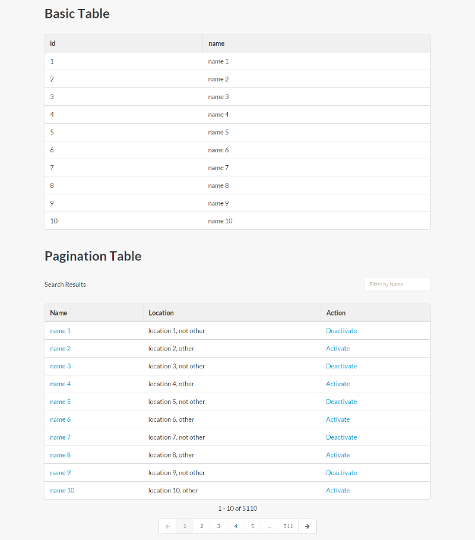

# sm-table
Mithril semantic-ui data table widget

It requires mithril and semantic-ui-table, semantic-ui-loader and [sm-pgination](https://github.com/pinguxx/sm-pagination) if you need pagination

Pagination file can be used with any common.js it is expect for mithril to be in global (m variable) or it will attempt to load it with `require('mithril')`, [webpack](http://webpack.github.io/docs/) its recommended

It can be used with bootstrap also, just pass the correct classes



## Code Example

See complete code in test.html

```html
<!DOCTYPE html>
<html>
<head>
    <link rel="stylesheet" href="https://cdnjs.cloudflare.com/ajax/libs/semantic-ui/1.10.3/semantic.min.css">
    <script src="bower_components/mithril/mithril.js"></script>
    <script src="bower_components/sm-pagination/Pagination.js"></script>
    <script src="Table.js"></script>
</head>
<body>

    <script src="test.js"></script>
</body>
</html>
```

```JavaScript
module.controller = function () {
    module.vm.init(array);
};
module.vm = {};
module.vm.init = function (data) {
    this.customers = data;
    this.rowsperpage = 10;
    this.table = new Table({
        columns: ['id', 'name'],
        data: data
    });
};
module.view = function (/*ctrl*/) {
    return m('.ui.grid.page', [
        m('h1', 'Basic Table'),
        m('.ui.sixteen.wide.column', [
            module.vm.table.view()
        ])
    ]);
};

m.module(window.document.body, module);
```

## Attributes
It accepts the following properties, columns and data or url the only ones mandatory

 * columns, array of columns to display
 * data, data to display, should be an array
 * url, url to load the data
 * pagination, object with pagination options
 * filter, function to apply the filter
 * onclick, function to call when a cell is clicked
 * classes, object map with:
    * **table**, applied to the table, defaults `ui table sortable`
    * **columnLoading**, applied to the only column in the only row when the table its loding data, defaults `center aligned`
    * **loader**, applied to the div insdide the loading column when the able its loading data, defaults `ui active loader inline`
    * **columnNoResults**, applied to the only column in the only row when no results are being displayed, defaults `center aligned`
    * **sortedAscending**, applied to the header when is sorted ascending, defaults `sorted ascending`,
    * **sortedDescending**, applied to the header when is sorted descending, defaults `sorted descending`
    * **notSorted**, applied to the header when its not being sorted, defaults ``
    * **disabled**, applied to the disabled headers, defaults `disabled`
    
### Coumns Definitions

The array of columns can be either an array of strings with the fields you want to display or an array of objects, that must have a field at least
column:
 * field: field to get the text,
 * label: to display in the header,
 * format: function to format the cell/row, if you return something here this will be placed as text in the m function m('td', attr, text), the function receives
    * value, field value
    * object, current item object
    * celAttributesObject, column attrbiutes, these will be passed to the m function as m('td', attr)
    * rowAttributesObject, row attributes, these will be passed to the m function as m('tr', attr)
    * index, index of the current row
    * getterFunction, if you are passing a getter, this functino will be provided to get the same as the get
 * sort: sortable function that must return a function for the table sorting, if the column is sortable and there is no sort function, it will use a simple sorting, this function receives
    * key, current object field
    * ascending, boolean for ascending
    * getter, the get function for the current field
 * sortable: boolean to make the column sortable,
 * get: function to format the display value of the column, must return a string or an m element, it receives the current item object,
 * classes: class to apply to the column

## Functions
Creating a table
```JavaScrit
var table = new Table({
    colums: ['id', 'name']
});
```
Loading the view table, you can pass data again to override the current data
```JavaScrit
m('div', table.view())
m('div', table.view(data))
```
You can jump to a page if the table is using pagination
```JavaScrit
table.goToPage(2);
```
You can get the cell, row or data from an event started inside the cells
```JavaScrit
table.getCell(e); //<td></td>
table.getRow(e); //<tr></tr>
table.getRow(cell); //<tr></tr>
table.getData(e); //Object
```
You can also update the data with
```JavaScrit
table.setData(data);
```